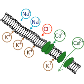

### Equilibrium potential & Resting membrane potential

Inside a cell, there are various ions present. For instance, a typical human cell contains potassium, sodium, calcium ions and a few other ions in lesser quantities. Maintaining these ions in particular concentrations, so that the cell functions are carried out properly, is the done by the semi-permeable membrane. 

As the name suggests, a semi-permeable membrane allows only certains substance to pass through it. In a way, it separates the cell from its surroundings. It is essentially a phospolipid layer with proteins embedded in it. These proteins act as tunnels and have affinity for specific ions. The entry and exit of ions through these tunnel porteins is regulated by conformations of those proteins.

For this lesson, we consider a human nerve cell (or neuron).

A nerve cell consists of following parts:
- Cell body: It contains mitochondria, nucleus, and other cell organelles.
- Axon: It is the elongated structure, characteristic to nerve cells, which is responsible for carrying action potentials.
- Dendrites: It is the brach-like structure which connects a nerve cell with other cells.

Now consider a small section of the axon. We then see that the cell membrane separates the intercellular matter (cytoplasm) from the extracellular matter. The presence of ions separated y a semi-permeable membrane gives rise to two forces. Namely, diffusion (due to concentration gradient) and electric (due to electric field created by ions).

The concentration of K+ ions is more inside the cell than outside. Thus, the K+ ions flow outside the cell making inside of the cell more negative. If we could zoom in just near the membrane we would see negative charges inside and positive charges outside. Does this remind you of something? Yes, a capacitor (more on that later). 

When you separate two charges, some work is done and this work done for moving one charge away from another is called electric potential. In this case too, the cell membrane has an electric potential. Now, the inside of the cell is negative, outside is positive, so the electric field established will tend to bring positive charges in i.e. against the concentration gradient. 

If we observe long enough time, we'd observe that the two forces will eventually attain equilibrium and that inward and outward flow for that particular ion (here K+) will be the same. Thus, the net flow of K+ will be zero. The potential when the rate of net flow of K+ ions is zero is called equilibrium potential for K+.

Similarly, other ions too have their very own equilibrium potential. Also called as Nernst potential of that ion, it depends on the temperature, concentration of ion and valency of that ion. 

<!-- $$
E_{ion} = \frac{RT}{nF} ln(\frac{[ion_{out}]}{[ion_{in}]}) 
$$ --> 

Above equation is called Nernst potential for a particular ion given the temperature of the system and its concentration inside and outside the cell. F is Faraday's constant and n is valency of that ion.

Recall that there isn't only on ion (say K+) but many others too (like Ca2+, Na+, etc.). So every ion will have its own equilibrium potential. The potential when the net flow in and out through the semi-permeable membrane will be zero, is that cell's resting potential. If the concentration of one ion present is very high then the equilbrium potential of that ion and the resting membrane potential will be almost the same. 

***
